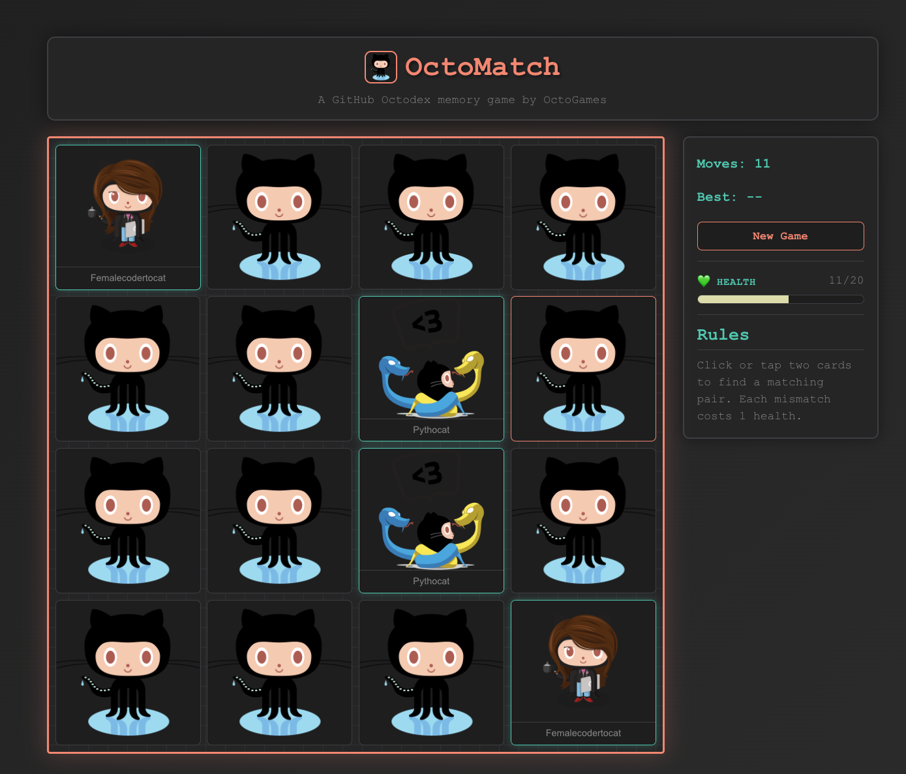
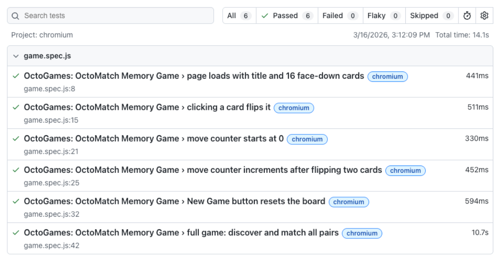
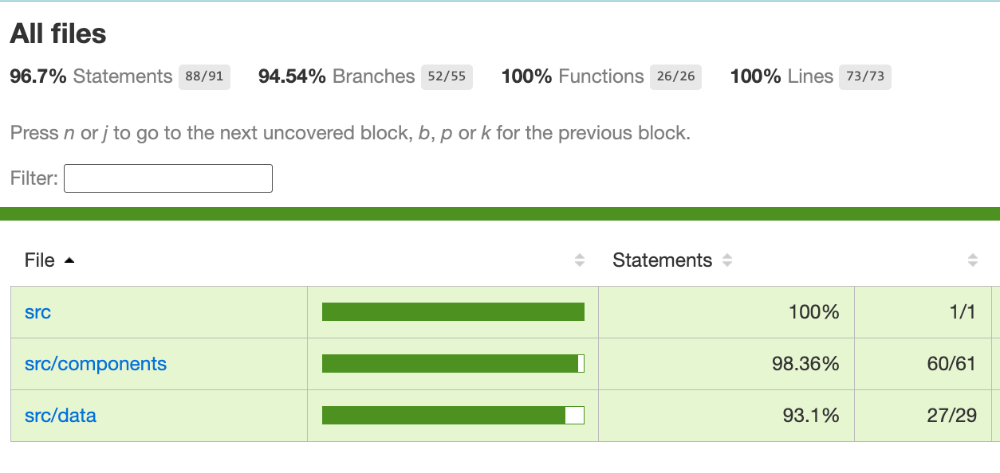
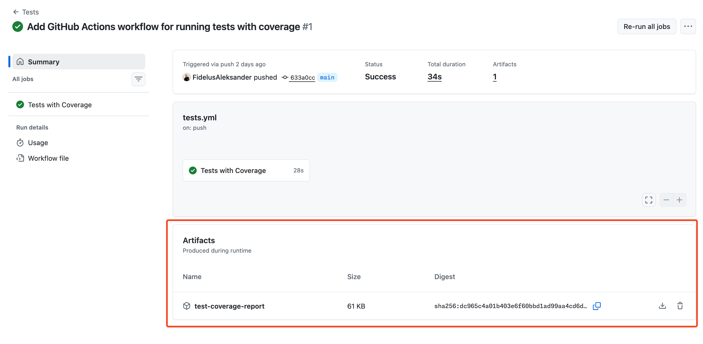

## Step 1: Hello Workflow Artifacts!

You are a developer on the Octomatch team - the Octodex memory card game.

<details>
<summary>🎮 Preview the Octomatch game</summary>


</details>

You've already set up tests that generate useful reports. Now you want to run those tests in GitHub Actions and make the results easy to access for every run.

To do that, your team has decided to upload these reports as 📦 **workflow artifacts**.

| Browser Tests Report                                                                 | Coverage Report                                                               |
| -------------------------------------------------------------------------------------- | ----------------------------------------------------------------------------- |
|  |  |

### 📖 Theory: What are workflow artifacts, and when should you use them?

In GitHub Actions, every job runs on a fresh virtual machine or container. This means that any files generated during a job will be lost once the job finishes.

A **workflow artifact** is a file or collection of files saved during a workflow run.

Artifacts let you keep useful outputs after a job finishes so your team can inspect them later or use them in subsequent workflow jobs.

Common artifact examples:

- 🧪 **Test outputs**: Results, failures, and screenshots that make debugging easier.
- 📊 **Coverage data**: Coverage reports that show test quality and gaps.
- 📦 **Build outputs**: Built app files or compressed bundles.
- 📝 **Logs**: Runtime and diagnostic logs that help investigate issues quickly.

To upload artifacts in GitHub Actions, it's recommended to use the official [actions/upload-artifact](https://github.com/actions/upload-artifact) action.


### ⌨️ Activity: Set up your development environment

Let's use **GitHub Codespaces** to set up a cloud-based development environment and work in it for the remainder of the exercise!

1. Right-click the below button to open the **Create Codespace** page in a new tab. Use the default configuration.

   [](https://codespaces.new/{{full_repo_name}}?quickstart=1)

1. Ensure you are creating a codespace on your copy of the exercise (`{{full_repo_name}}`)

1. Wait a moment for Visual Studio Code to fully load in your browser.

   > ⏳ **Wait:** This can take up to a few minutes. If you get errors, click [here](https://codespaces.new/{{full_repo_name}}?skip_quickstart=true&hide_repo_select=true) and try creating a codespace in a different region.

1. (optional) Once your codespace is fully loaded you can run the following command to see the **Octomatch** application running:

   ```bash
   npm run dev
   ```

   Feel free to take a moment and play the game!

### ⌨️ Activity: Create the first artifact upload workflow

Let's start off by creating a workflow that will run unit tests with coverage and upload the `coverage/` directory as an artifact.


1. In your codespace, in the `.github/workflows` directory create a new workflow file named:

   ```text
   tests.yml
   ```

1. Add the following content to the workflow file:

   ```yaml
   name: Tests

   on:
     push:
       branches:
         - main
     pull_request:
       branches:
         - main

   permissions:
     contents: read

   jobs:
     coverage:
       name: Tests with Coverage
       runs-on: ubuntu-latest
       steps:
         - uses: actions/checkout@v6
         - uses: actions/setup-node@v6
           with:
             node-version: 24
             cache: npm
         - run: npm ci
         - run: npm run test:coverage
         - uses: actions/upload-artifact@v7
           with:
             name: test-coverage-report
             path: coverage/
   ```

   The `npm run test:coverage` command generates a coverage report in the `coverage/` directory, and the `actions/upload-artifact` step uploads that entire directory as an artifact named `test-coverage-report`.

1. Commit and push your workflow file to the `main` branch. This will trigger the workflow run.

1. Navigate to the **[Actions](https://github.com/{{full_repo_name}}/actions/workflows/tests.yml)** tab and click on the running `Tests` workflow to see the tests execute in real time.

   > 💡 **Tip:** Refresh the page if you don't see the workflow running. It may take a few seconds.

1. When the workflow succeeds, you should be able to see the uploaded artifact in the workflow summary page:

    

1. Click the artifact name to download it. It will download as a `.zip` file.

1. Extract the downloaded `.zip` file and open the included `index.html` file to view the report in a more readable format.

    

1. When the workflow completes, Mona will provide feedback and next steps.

<details>
<summary>Having trouble? 🤷</summary><br/>

Make sure that:

- you named your workflow file **exactly** `tests.yml` 
- that the workflow is located in the `.github/workflows` directory
- that you pushed the workflow file to the `main` branch

</details>
