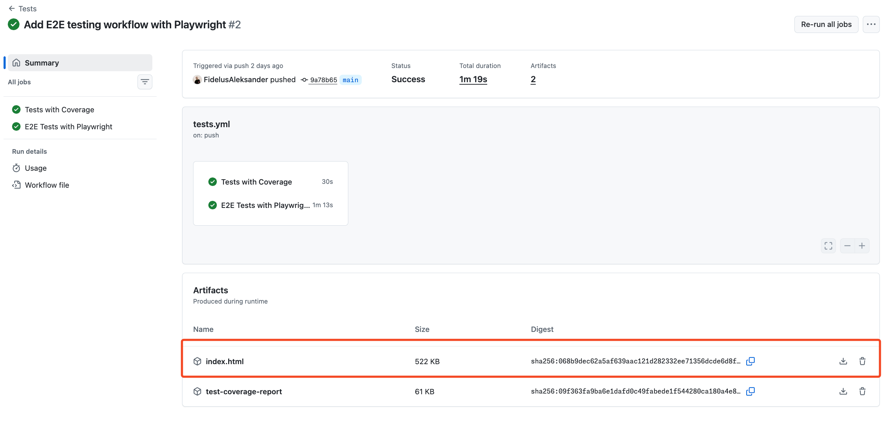

## Step 2: Direct single-file upload

Great start! Your workflow already uploads unit test coverage, and now the team needs browser test evidence too 🌐

It would be even better if the report could be previewed **directly in the browser** without needing to download and extract a `.zip` file first.

Let's do that!

### 📖 Theory: Uploading artifacts without zipping 📦

Workflow artifacts are uploaded as `.zip` files by default. However, there is also support for **direct uploads** by setting the `archive` parameter of the `actions/upload-artifact` action to `false`, allowing files to be uploaded without being archived.

This is useful when the uploaded file can be opened directly in the browser, which adds convenience in cases like HTML reports.

> [!IMPORTANT]
> Direct uploads are currently only available for single files.

### ⌨️ Activity: Run browser tests and upload a report you can open

Now we will extend the workflow to run [Playwright](https://playwright.dev/) browser-based **end-to-end (E2E)** tests and upload a single HTML report that can be previewed in the browser.

1. Open `.github/workflows/tests.yml` in your codespace.

1. Add the below `e2e` job after the existing `coverage` job in the workflow file:

   ```yaml
   e2e:
     name: E2E Tests with Playwright
     runs-on: ubuntu-latest
     steps:
       - uses: actions/checkout@v6
       - uses: actions/setup-node@v6
         with:
           node-version: 24
           cache: npm
       - run: npm ci
       - run: npx playwright install --with-deps chromium
       - run: npm run test:e2e
       - uses: actions/upload-artifact@v7
         with:
           path: playwright-report/index.html
           archive: false
   ```

   Notice how we set the `archive` option to `false`. This will upload the Playwright report as a single file without zipping, allowing it to be previewed in the browser.

   The artifact `name` will be derived from the uploaded file name, so in this case it will be `index.html`.

1. Ensure that you formatted the YAML correctly and that the new `e2e` job is added at the same level as the existing `coverage` job.

   You can run this command that will highlight any syntax errors in your workflow file:

   ```bash
   actionlint .github/workflows/tests.yml
   ```

1. Commit and push your updates to the `main` branch. This will trigger the workflow run.

1. Navigate to the **[Actions](https://github.com/{{full_repo_name}}/actions/workflows/tests.yml)** tab and click on the running workflow to see the tests execute in real time.

1. When the workflow succeeds, you should see the uploaded Playwright report artifact (`index.html`) in the workflow summary page:

   

1. Click on the artifact to open the Playwright report directly in the browser.

   
