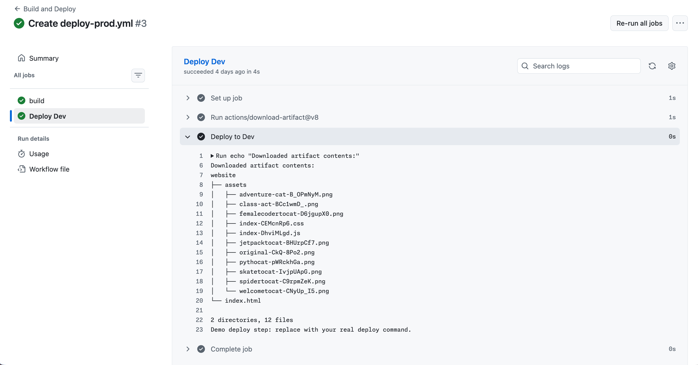

## Step 3: Build and deploy with artifact downloads

Great progress! You're already an expert on uploading workflow artifacts!

Now, how do you download these artifacts in GitHub Actions workflows?

Let's learn that!

### 📖 Theory: Downloading artifacts

GitHub provides the official [actions/download-artifact](https://github.com/actions/download-artifact) action to retrieve files that were previously uploaded as workflow artifacts.

In the simplest case, a later job in the same workflow can download an artifact **by name** and use its contents **without rebuilding them**.

Key things to remember:

- 📦 Artifacts are tied to a specific **workflow run**.
- 🔁 A later job in the same run can download artifacts from an earlier job.

### ⌨️ Activity: Create the build and deploy workflow

Let's set up a workflow that will build the site and upload it as an artifact, then a downstream job that will download that artifact and simulate a deployment step.

1. Create a new workflow file in `.github/workflows` named:

   ```text
   build-deploy.yml
   ```

1. Add the following content to the workflow file:

   ```yaml
   name: Build and Deploy

   on:
     workflow_dispatch:
     push:
       branches: [main]

   permissions:
     contents: read

   jobs:
     build:
       runs-on: ubuntu-latest
       steps:
         - uses: actions/checkout@v6
         - uses: actions/setup-node@v6
           with:
             node-version: 24
             cache: npm
         - run: npm ci
         - run: npm run build
         - uses: actions/upload-artifact@v7
           with:
             name: octomatch
             path: dist
   ```

   This job builds the site and uploads it as an `octomatch` artifact so other jobs can download it.

   It will run on every push to `main` and can also be triggered manually from the Actions tab.

1. Now let's add another job that will download that artifact.

   Add the following `dev` job after the existing `build` job in the same `build-deploy.yml` workflow file:

   ```yaml
   dev:
     name: Deploy Dev
     needs: build
     runs-on: ubuntu-latest
     steps:
       - uses: actions/download-artifact@v8
         with:
           name: octomatch
           path: website
       - name: Deploy to Dev
         run: |
           echo "Downloaded artifact contents:"
           tree website
           echo "Demo deploy step: replace with your real deploy command."
   ```

   In this scenario we just list the contents of the downloaded artifact, but in a real workflow this is where you could run your deployment scripts.

1. Commit and push your changes to the `main` branch to trigger this workflow.

1. Navigate to the **[Actions](https://github.com/{{full_repo_name}}/actions/workflows/build-deploy.yml)** tab and inspect the logs of the `Deploy Dev` job.

   You should see the output of the `tree website` command showing the contents of the downloaded artifact

    
