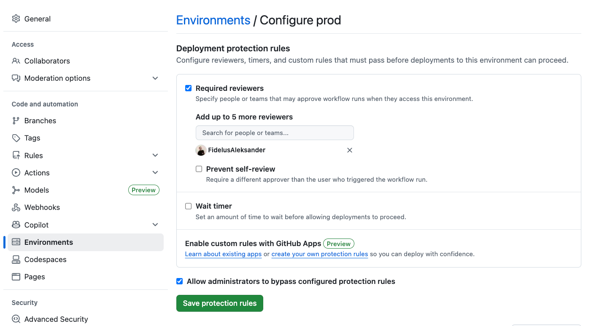
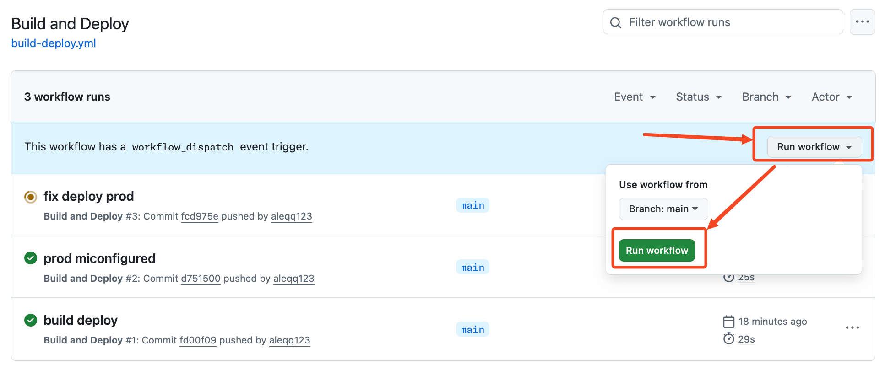
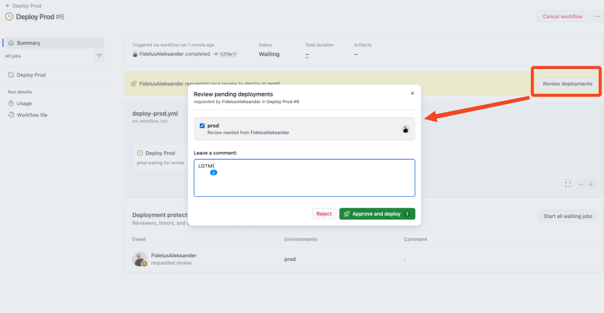

## Step 4: Cross-workflow downloads and production approvals

Great work so far. You can now upload reports and reuse artifacts inside a workflow.

Now let's take the next step: trigger a **separate production workflow** after your build workflow finishes and download artifacts across workflow runs.

You will also learn how to add a production approval gate using GitHub Environments.


### ⌨️ Activity: Create a Prod deployment workflow

Let's set up a prod deployment workflow that will run every time your build workflow completes.

1. Create a new workflow file in `.github/workflows` named:

   ```text
   deploy-prod.yml
   ```

1. Add the following content to the workflow file:

    ```yaml
    name: Deploy Prod

    on:
      workflow_run:
        workflows: ["Build and Deploy"]
        types:
          - completed

    permissions:
      contents: read
      actions: read
    ```

    This workflow will trigger every time the `Build and Deploy` workflow run completes.

    The `actions: read` permission is included so this workflow can download artifacts from other workflows.

1. Now let's add a job that will download the artifact produced by the `Build and Deploy` workflow.

    ```yaml
    jobs:
      prod:
        name: Deploy Prod
        runs-on: ubuntu-latest
        if: github.event.workflow_run.conclusion == 'success' 
        environment: prod
        steps:
          - uses: actions/download-artifact@v8
            with:
              name: octomatch
              path: website
              run-id: ${{ github.event.workflow_run.id }}
              github-token: ${{ secrets.GITHUB_TOKEN }}

          - name: Deploy to Production
            run: |
              echo "Downloaded artifact contents:"
              tree website
              echo "Demo deploy step: replace with your real deploy command."
    ```

    The `if` conditional ensures this job only runs if the triggering workflow completed successfully - without errors.

    The `run-id` and `github-token` parameters are required to download artifacts from a different workflow run. The `run-id` is obtained from the triggering event payload.

1. Commit and push your changes to the `main` branch.

1. Monitor the workflow in the **[Actions](https://github.com/{{full_repo_name}}/actions/)** tab.

    The commit will trigger the `Build and Deploy` workflow, and when that completes, the `Deploy Prod` workflow should get triggered as well.


### ⌨️ (optional) Activity: Configure production approval protection

Nice work! If you want an extra challenge, this bonus activity adds an approval gate to your production deployment using GitHub Environments **required reviewers**.




> [!IMPORTANT]
> Mona here :wave:
>
> I've noticed your repository visibility setting is set to **{{ repo_visibility }}**. Depending on your [GitHub plan](https://github.com/pricing), environment required reviewers may not be available for you.
>
> To complete this optional activity, you may need to change the repository to **public** at the bottom of the [repository settings](https://github.com/{{full_repo_name}}/settings).



<details>
<summary>✨ Show bonus activity steps</summary>

1. Go to your repository **[settings](https://github.com/{{full_repo_name}}/settings)**.
1. In the left sidebar, select **[Environments](https://github.com/{{full_repo_name}}/settings/environments)** tab.
1. Click the **prod** environment to edit it. Add yourself (`{{ login }}`) as a required reviewer and save the changes.

    

   This will cause any job that targets `environment: prod` to pause and wait for your review before proceeding.

1. Go to the **[Actions](https://github.com/{{full_repo_name}}/actions/workflows/build-deploy.yml)** tab and use the `Run workflow` dropdown to manually trigger the `Build and Deploy` workflow.

   

   > 🪧 **Note:** This button is available because of the `workflow_dispatch` event trigger you added

   This workflow does not have any jobs targeting `prod`, but once it completes, it will trigger the `Deploy Prod` workflow we just created. That workflow targets `prod` environment and will pause, awaiting your approval.


1. Once the `Deploy Prod` workflow is triggered, click on it to see the details. You should see a yellow banner indicating that the job is waiting for approval.

    

1. You’ll now be prompted to approve or reject the deployment. Your message and decision will be displayed in the workflow run details for auditing purposes.

</details>
